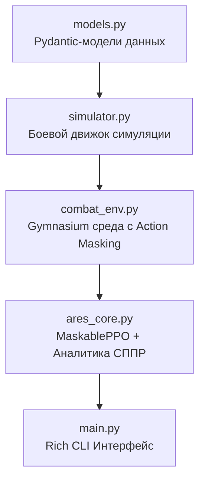

# ARES: Adversarial Roleplaying Equilibrium System

[](https://www.python.org/)
[](https://gymnasium.farama.org/)
[](https://sb3-contrib.readthedocs.io/)
[](https://github.com/Textualize/rich)
[](https://opensource.org/licenses/MIT)

**ARES** — автоматизированная система поддержки принятия решений (СППР / Decision Support System) для балансировки пошаговых боевых систем RPG.

Вместо сотен часов ручного плейтестинга и табличных расчетов система использует **обучение с подкреплением (Reinforcement Learning)** с **динамическим маскированием действий (Action Masking)** и **состязательным зеркальным тестированием (Self-Play)** для поиска эксплойтов, доминирующих связок навыков, перма-станов и мертвых способностей.

---

## Архитектура системы



---

## Ключевые возможности

### 1. Обучение с подкреплением и Action Masking
* **MaskablePPO (`sb3-contrib`):** В отличие от стандартного PPO, маскирование действий отсекает недопустимые ходы (недостаток маны, кулдаун навыка, оглушение) непосредственно в вероятностном распределении политики актора.
* **Чистый Reward Signal:** Агенту не требуются искусственные штрафы за невалидные действия, что ускоряет сходимость и предотвращает застревание в локальных оптимумах.

### 2. Реалистичная пошаговая боёвка и статус-эффекты
* **Инициатива и стохастика:** Бросок инициативы (50/50), разброс урона (±15%), критические удары (10%).
* **Эффекты контроля и статусы:**
  * `[STUN]` (Оглушение) — принудительный пропуск хода через маску действий.
  * `[DOT]` (Периодический урон) — тикающий урон в фазе начала хода (`start_turn_phase`).
  * `[SHIELD]` (Поглощение) — временный буфер урона с механикой пробития.
  * `[BUFF_ATTACK]` / `[DEBUFF_DEFENSE]` — динамические модификаторы характеристик.

### 3. Состязательное тестирование (Multi-Agent Evaluation)
* **vs Random:** Проверка устойчивости против стохастических действий.
* **vs Greedy:** Оценка выживаемости против противника с эвристикой максимизации урона.
* **vs Self-Play (Mirror):** Зеркальный поединок обученной нейросети против самой себя в симметричных условиях для проверки справедливости первого хода и объективной силы стратегии.

### 4. Аналитическое ядро СППР (Decision Support System)
Трёхуровневый алгоритм детекции дисбаланса формирует математически обоснованные рекомендации:
* `[CRIT_IMBALANCE]`: Средний Win Rate агента >= 85%. Мета признаётся критически разбалансированной; система замораживает баффы и приоритизирует нерфы.
* `[EXPLOIT_ROTATION]`: Две способности занимают >= 70% общего Pick Rate при среднем TTK <= 5 ходов. Рекомендован жёсткий нерф: урон -15%, кулдаун +1, стоимость +3 MP.
* `[DOMINANT]`: Pick Rate >= 40% при Win Rate >= 80%. Рекомендован нерф: урон -15%, кулдаун +1.
* `[PERMA_STUN_EXPLOIT]`: Агент побеждает, удерживая врага в оглушении > 40% времени боя. Рекомендация: кулдаун +1, длительность стана -1.
* `[LOW]`: Pick Rate < 5%. Навык помечается как недоиспользуемый; бафф размораживается только после устранения доминантных ротаций.

### 5. Интерактивный терминальный интерфейс
* Строгий академичный стиль на базе библиотеки Rich (текстовые теги `[OK]`, `[LOW]`, `[DOMINANT]`, `[CRIT]`, таблицы метрик, прогресс-бары).
* Встроенный модуль **сценарного анализа «Что, если?»** — изменение характеристик навыков с немедленным повторным прогоном стресс-теста.
* Экспорт отчётов аудита в формате Markdown (`report.md`).

---

## Структура проекта

```text
ARES/
├── models.py          # Pydantic-модели (Actor, Skill, StatusEffect, CombatConfig, BalanceReport)
├── simulator.py       # Детерминированно-стохастический боевой симулятор
├── combat_env.py      # Среда Gymnasium с Action Masking и симметричным вектором состояний
├── ares_core.py       # Обучение MaskablePPO, оценка политик и ядро генерации рекомендаций СППР
├── main.py            # Интерактивный CLI-интерфейс (главное меню, стресс-тесты, сценарный анализ)
├── requirements.txt   # Список внешних зависимостей
├── report.md          # Пример сгенерированного отчёта СППР
├── models/            # Директория с чекпоинтами моделей (.zip)
│   └── ares_agent.zip # Предобученный агент MaskablePPO
├── .gitignore         # Правила игнорирования временных файлов и кэша
└── LICENSE            # MIT License
```

---

## Быстрый старт

### 1. Клонирование репозитория
```bash
git clone https://github.com/KKitsue/ARES.git
cd ARES
```

### 2. Создание и активация виртуального окружения
```bash
# Windows
python -m venv .venv
.venv\Scripts\activate

# Linux / macOS
python3 -m venv .venv
source .venv/bin/activate
```

### 3. Установка зависимостей
```bash
pip install --upgrade pip
pip install -r requirements.txt
```

### 4. Запуск системы
```bash
python main.py
```

---

## Использование и режимы работы

При запуске `python main.py` доступно интерактивное главное меню:

* **[1] Запустить стресс-тестирование баланса**
  Обучение агента `MaskablePPO` (20 000 шагов) и оценка стратегий против `Random`, `Greedy`, `Mirror`.
* **[2] Посмотреть отчёт СППР**
  Аналитические метрики (Win Rate, TTK, Pick Rate), детекция эксплойтов и рекомендации по ребалансу.
* **[3] Сценарный анализ «Что, если?»**
  Интерактивная правка характеристик навыков и мгновенная перепроверка баланса обновленной меты.
* **[4] Экспорт отчёта в файл**
  Сохранение текущего отчёта СППР в форматах Markdown (`report.md`) или JSON для геймдизайнеров.
* **[0] Выход**
  Завершение работы программы.

---

## Пример отчёта СППР

```markdown
# Отчёт СППР — ARES

## Метрики баланса
| Оппонент               | Win Rate | Средний TTK |
|------------------------|----------|-------------|
| vs Random              | 98.0%    | 3.2 ходов   |
| vs Greedy              | 84.0%    | 2.9 ходов   |
| vs Self-Play (Mirror)  | 52.0%    | 3.0 ходов   |

## Рекомендации по ребалансу
- [CRIT_IMBALANCE] [EXPLOIT_ROTATION] Навык «Огненный шар» входит в доминирующую ротацию. Pick Rate: 88.2%, Avg WR: 91.0%, Avg TTK: 3.0 ходов. Рекомендован жёсткий нерф: урон -5 ед., кулдаун +1, стоимость +3 MP.
- [BUFF | ЗАМОРОЖЕНО: применять только после нерфа доминирующей ротации] Навык «Ледяная стрела» не используется (Pick Rate: 0.0%). Рекомендован бафф: урон +2 ед., стоимость -3 MP.
```

---

## Лицензия

Проект распространяется под лицензией [MIT](LICENSE).
